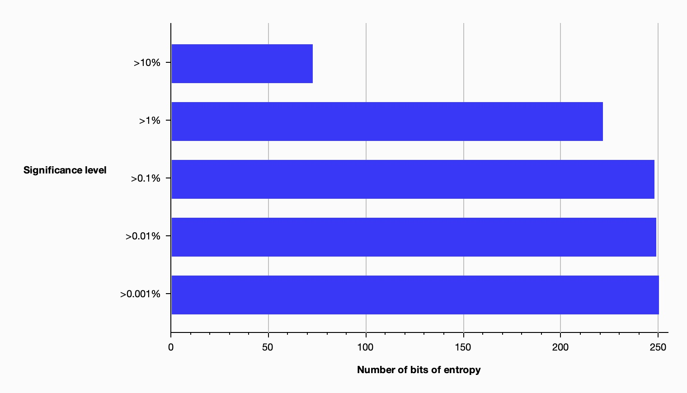

# Penetration Peer Testing

| Participant         | System URL                        | JWT Pizza Service Repo                              |
| ------------------- | --------------------------------- | --------------------------------------------------- |
| **James Finlinson** | https://pizza.wheatharvest.llc    | https://github.com/frozenfrank/jwt-pizza-service/   |
| **Stephen Morgan**  | https://pizza.kepelcomputing.com  | https://github.com/StephenKMorgan/jwt-pizza-service |

## Self Attack

### James Finlinson (wheatharvest.llc)

I anticipated and protected myself against the following security attacks:

| Attack Type | Potential Severity | Description | Commits |
| ----------- | ------------------ | ------ | ---- |
| Security Misconfiguration | **High** | Change password for each of the following default, privileged users: a@jwt.com, f@jwt.com. | Issue #9 |
| Vulnerable Components | **High** | Review and remove code-injecting 3rd party dependency. | d7bc8f9 |
| Authentication Failure | **Low** | AuthTokens used to be deterministic by the incoming request. This did allow requests to bypass extant-franchise requirements. There was low actual impact of this because no valuable targets were exposed by this vulnerability. | f322e8d, af7f566 |
| Insecure Design | **Medium** | Order processing did not validate menu prices and allow cheaper or negatively priced pizzas. This would have impacted profits for a business. | b1ed785, 407c845 |
| Software Integrity Failures | **Low** | `npm` reported multiple times that my dependencies had vulnerabilities. I ran the update scripts to upgrade properly. | ee912a2 |
| Insecure Design | **Medium** | System did not enforce uniqueness of emails. Also, users can change their emails without any validation. This means that a user who signed up earlier in time to another user, could change their email and cause a DoS attack on another specific individual. | 9247c1d |

### Stephen Morgan

#### Finding 1

| Item | Details |
|------|---------|
| Date | 12/5/2024 |
| Target | https://pizza.kepelcomputing.com/menu |
| Classification | Injection |
| Severity | High |
| Description | SQL injection possible in the curl updateUser command |
| Images | const query = `UPDATE user SET ${params.join(', ')} WHERE id=${userId}`; This directly interpolates values into the SQL string, thus direct array interpolation could be exploited.  |
| Corrections | Added sanitization to Database.js to avoid injection attacks |

#### Finding 2

| Item | Details |
|------|---------|
| Date | 12/5/2024 |
| Target | https://pizza.kepelcomputing.com/delivery |
| Classification | Broken Access Control |
| Severity | Critical |
| Description | Server-side request forgery allowed the user to modify the order request and change the price |
| Images |  The price is larger and negative |
| Corrections | Added server-side validation of orders in orderRouter.js |

## Peer Attack

### Against Stephen (kepelcomputing.com)

**Target:** https://pizza.kepelcomputing.com
**Date:** 12/5/2024
**Tester:** James Finlinson
**Tools Used:** Burp Suite

#### Security Misconfiguration

| Item | Details |
|------|---------|
| Date | 12/6/2024 |
| Target | https://pizza-service.kepelcomputing.com/api/auth/1 |
| Classification | Security Misconfiguration |
| Severity | High |
| Description | Exposed default database credentials allow immediate and easy admin access. I removed the root access by changing the password to my own, and could have gone further to delete or modify or change other sensitive portions of the database. |
| Images |   |
| Corrections | Change default admin credentials. |

#### Additional Attempts

No other meaningful vulnerabilities were detected in the target system. Attempted attack vectors include:
* Scanning for unprotected endpoints. _None found._
* Ordering pizzas with discounted pizza prices. _Request validated by server._
* Ordering pizzas with negative pizza prices. _Request validated by server._
* Registering users with the same email as the admin. _User created, but could not login afterwards._
* Changing my user to have the default admin email address. _Did not grant access._
* Generated a blanket of automated traffic to mask penetration attempts.
* Analyzed uniqueness of auth tokens. _They have sufficient entropy._

    

* Reuse originally retrieved valid admin auth token. _AuthTokens set to expire after 1 hour._

### Against James (wheatharvest.llc)

#### Report 1: Pizza Wheat Harvest Security Assessment

**Target:** https://pizza.wheatharvest.llc
**Date:** 12/6/2024
**Tester:** Stephen Morgan
**Tools Used:** Burp Suite

#### Executive Summary

Security assessment was performed on the pizza ordering application. No critical vulnerabilities were identified during testing.

#### Test Methodology & Results

##### 1. SQL Injection Testing

- **Approach:** Attempted SQL injection via input fields
- **Result:** No vulnerabilities detected
- **Status:** SECURE

##### 2. SSRF Testing

- **Approach:** Attempted server-side request forgery
- **Result:** No vulnerabilities detected
- **Status:** SECURE

##### 3. Access Control Testing

- **Approach:** Analyzed for broken access control patterns
- **Result:** No vulnerabilities detected
- **Status:** SECURE

##### 4. Cryptographic Implementation

- **Approach:** Analyzed responses for cryptographic weaknesses
- **Result:** No obvious cryptographic failures detected
- **Status:** SECURE

##### 5. Load Testing/DoS

- **Approach:** Attempted large volume of orders
- **Result:** System showed error under load
- **Note:** Error originated from pizza factory backend, not the application
- **Status:** PARTIAL CONCERN - Consider implementing rate limiting

#### Recommendations

1. Consider implementing order volume limits
2. Add rate limiting for order submissions
3. Continue monitoring for potential DoS vulnerabilities

#### Conclusion

The application shows good security implementation across tested vectors. The only notable finding was related to order volume handling, which is a backend service concern rather than an application security issue.

## Combined summary of learnings

Through our cross-team penetration testing efforts, we identified several key vulnerabilities in JWT Pizza deployments, including SQL injection vulnerabilities that could compromise menu data and server-side request forgery that allowed order price manipulation. While some systems showed robust security measures against common attack vectors, others revealed the need for enhanced input sanitization and server-side validation. The testing exercise highlighted the importance of implementing proper input validation, rate limiting for order submissions, and regular security audits. These findings led to immediate improvements in our codebase, including enhanced Database.js sanitization and strengthened orderRouter.js validation, ultimately resulting in more secure pizza ordering systems across all deployments.

Overall, we individually did a good job identifying and preventing attacks against our systems. No other exploitable details were found. One key lesson is that software security can be achieved with a reasonable degree of confidence just by following the standard best practices.

## Recommendation

Other than the items we each fixed, which were few in number, the application overall felt very secure.

We would recommend using the penetration attempts from current semester students to **expose additional _actual_ vulnerabilities** for students to find or attack next semester. Ideas include:
* Widespread use of string interpolation to enable SQL injection attacks
* Adjust the default behavior of `database:getUser()` to retrieve the _last_ user with an email rather than the first.
* Omit the authentication checks from some obscure endpoints. I.E. Omit the `authRouter.authenticateToken,` line from the endpoints in the routers.
* Include sensitive information in standard GET requests like `getFranchises()`.
